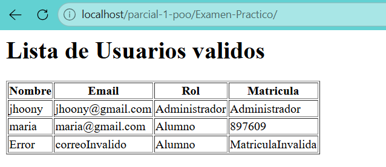

Para este examen practico simplemente reuse la practica 4 y elimine la clase invitado de la carpeta de clases y del index para evitar que de error, la clase de Usuario se queda sin eliminar nada o añadir al igual que en alumno y admin, a lo que si le añadimos fue al index con las tablas hechas con echo gracias a que tablas hechas por html dentro de <?php ?> no se puede, asi que se usa echo ""; para que pueda servir

