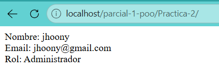

la clase usuario es codigo reautilizado de la practica una que permite la creacion del nombre y email del admin.
la clase admin extiende la clase usuario y permite la creacion del rol administrador, o mejor dicho que el usuario seleccionado en index tiene el rol de admin y regresa el valor "administrador"
la clase  index hereda la clase admin haciendo una cadena, primero hereda admin de usuario y ahora index hereda de admin para poder mostrar los valores ya mencionados y que estos esten seleccionados en index con sus funciones, por ejemplo getNombre getEmail getRol, y que en esas retorne los valores ya seleccionados, al final del documento index se crea un nuevo usuario al cual le asignamos el valor de jhoony y se vuelve a llamar la funcion mostrarInformacion para que se pueda mostrar en la pantalla del xamp.

