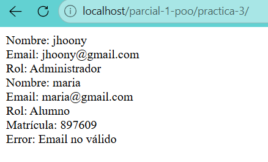

<<<<<<< HEAD
como se vio en la practica 2 de reciclaje de codigo aca mismo tambien se reciclo admin, el codigo de admin con un nuevo metodo que es el getMatricula, y tambien se reciclo codigo de index y usuario, pero en este caso en particular las clases admin, usuario y alumno estan dentro de una carpeta lo que modifica el camino a poner con require, en este caso usamos el require_once para evitar que la clase usuario se pida 2 veces con las clases admin y alumnos ocasionando un error en el xamp que diga "la clase Usuario esta siendo llamada multiples veces" o con una mejor descripcion "Cannot declare class Usuario, because the name is already in use in C:\xampp\htdocs\parcial-1-poo\practica-3\Clases\Usuario.php on line 2" aunque claro la linea varia dependiendo de donde la tengas.

=======
como se vio en la practica 2 de reciclaje de codigo aca mismo tambien se reciclo admin, el codigo de admin con un nuevo metodo que es el getMatricula, y tambien se reciclo codigo de index y usuario, pero en este caso en particular las clases admin, usuario y alumno estan dentro de una carpeta lo que modifica el camino a poner con require, en este caso usamos el require_once para evitar que la clase usuario se pida 2 veces con las clases admin y alumnos ocasionando un error en el xamp que diga "la clase Usuario esta siendo llamada multiples veces" o con una mejor descripcion "Cannot declare class Usuario, because the name is already in use in C:\xampp\htdocs\parcial-1-poo\practica-3\Clases\Usuario.php on line 2" aunque claro la linea varia dependiendo de donde la tengas.

>>>>>>> 5f4927aa7b013af799d3df74b4a182e9198b14f5
