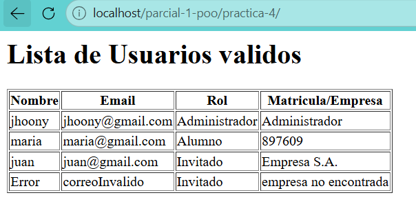

En este codigo en especifico fue mas complicado y por una simple razon, queria que se quitara el error: email invalido, que es un mensaje que aparecia antes ahi, busque y busque y me di cuenta que el error estaba en la usuario y el exception tenia que ponerlo en el setEmail para que funcionara correctamente, luego de eso fue facil crear la clase invitado, nomas recicle el codigo de alumno cambie las variables de matricula a empresa.
el index fue mas complicado esta ves, si ponia un error en los emails o en cualquier parte de la info sobre los usuarios desaparecian, si quitaba una letra de alumno la clase invitado desaparecia, como solucione esto? usando try/catch para cada funcion, try/catch para admin, try/catch para alumno, try/catch para invitado y finalmente para usuarioError para que se pudiera crear un cliente invalido para que estas condiciones de catch exception dieran trigger al usar la clase invitado como base para este nuevo usuario invalido.

