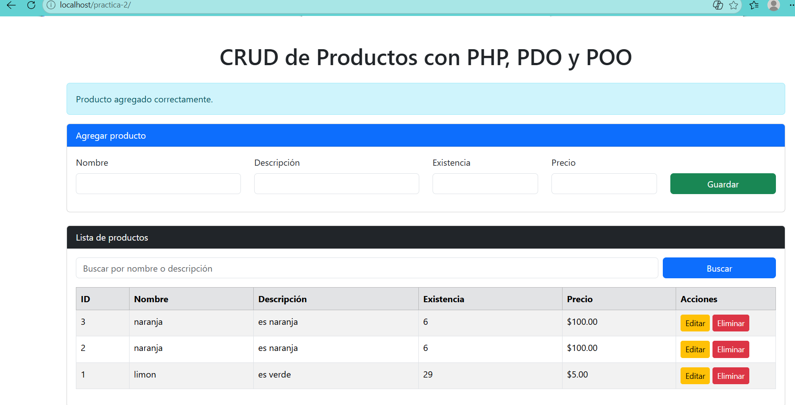
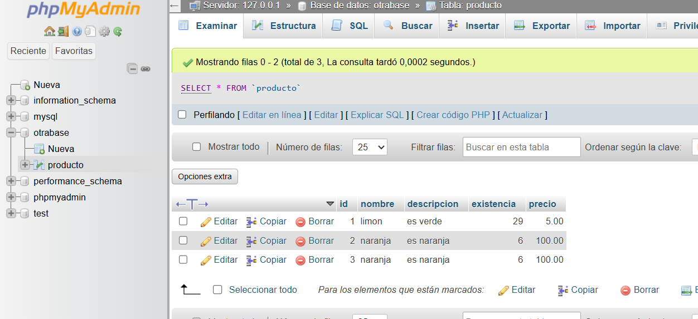

lo primero, en la carpeta de config tenemos la conexion a la base de datos usamos el try/catch para capturar el error por si acaso algo este mal como podria ser el nombre de la base de datos, contraseña, usuario etc, y con el errmode_exception y fetch_assoc son los elementos de pdo que hace que nuestro codigo se pueda proteger de las inyecciones dde mysql evitando que se filtre la informacion de la base de datos.
en la carpeta models es la representacion visual de la tabla de base de datos que tenemos en phpmyadmin con los metodos get y set por cada atributo como lo son, getId, setNombre, para establecer un valor con set y con get poder pedir ese mismo valor despues.
en controllers tenemos los controladores como bien lo dice su traduccion al usar __DIR_ (lo pongo de esta manera para evitar algo problema) es que podemos pedir los datos tanto de la conexion a base de datos como la representacion de la entidad sobre la tabla, este se encarga de poder hacer los query que mas adelante llamaremos en el index que tendremos para cada cosa, al usar :nombre le dejamos al usuario que lo establesca el mismo en ves de nosotros ya establecerlo dentro del "-" y asi evitar errores o conflictos usamos eso para cada atributo de la tabla, y al usar :id y en mysql dejamos que se auto incremente y asi poder seleccionarlo una vez que lo busquemos.
finalmente tenemos el infame index donde ya por fin llamamos a todas las funciones de controller y con html ponemos la interfaz para que el usuario la pueda seleccionar y buscar, dentro de ahi se puede guardar, eliminar, actualizar, buscar por id, y editar los atributos, a la hora de guardar un nuevo producto este se agrega a la tabla de abajo y cuando agregas 2 notamos como su id se auto incrementa que fue algo que se selecciono dentro de la base de datos cuando creamos esta tabla.

